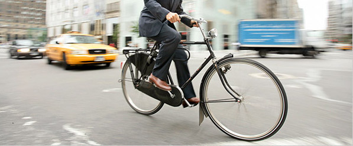

# RideNYC

#### Description

Biking to work makes you happier. While most people would not identify sitting in traffic, navigating a congested city, or riding crowded public transit as activities that calm them down or make them happy, cycling to work can actually transform your daily commute into a moderate form of therapy. Numerous studies have shown that daily exercise can reduce stress, alleviate symptoms of depression, improve sleep patterns for individuals with insomnia, and reduce anxiety. Furthermore, exercising outdoors – both in urban and rural contexts – has been proven to boost self-confidence and improve overall mood.

#### Dashboard 1
1. This dashboard shows that New York City has a high number of stations. The map shows that a big concentration of this stations are focused in Manhattan and Brooklyn.
2.  Route from E 7St & Avenue A to Cooper Square & Astor Pl is the most popular route for Subscribers, while routes inside Central Park are mostly popular for customers.
3. Also, it is noticed that demand has a seasonal effect and varies by Subscribers/Customers.
4. The most popular start and end station is Pershing Square North.

#### Dashboard 2

1.  There is an obvious trend that  bicycles are mostly popular during period May -October. 
2.  In NYC bikes are mostly used by Millennials. The Generation who prefers to be fast. 
3. Bike are in a high demand during commute time. So peak hours are  7.00-9.00am  and 17.00-19.00pm.
4. It can be noticed that some station has more popularity for Females. But in general Males are major users of bikes.

#### Steps:
1. Download Data from the [source](https://s3.amazonaws.com/tripdata/index.html) - starting from January 2018 to December 2018 (included). Example: 201801-citibike-tripdata.csv.zip
2. Data should be unarchived  and placed into main folder to open RideNYC.tbw

